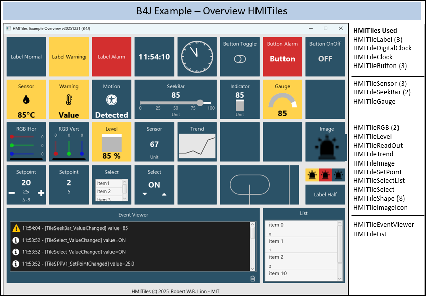
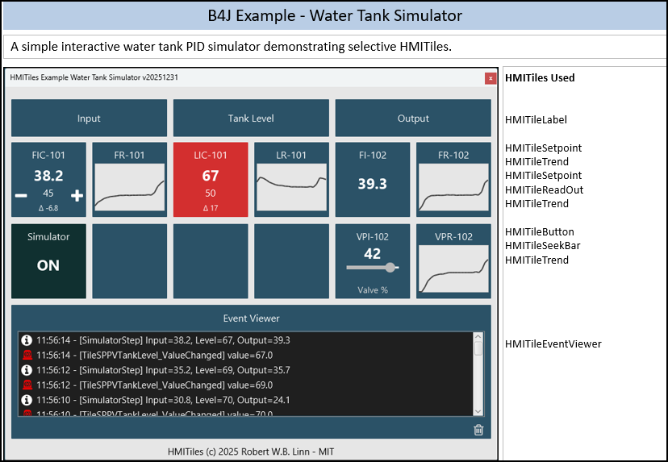
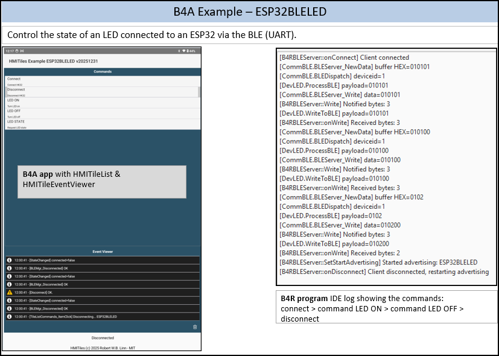

# HMITiles
**An Open-Source HMI Tile Library for Industrial Dashboards**

---

## Overview

HMITiles is an open-source HMI (Human Machine Interface) tile library written in [B4X](http://www.b4x.com), following widely accepted industrial HMI principles.

It provides reusable, professional-grade HMI tiles for:
- Industrial dashboards
- SCADA (Supervisory Control and Data Acquisition) front-ends
- Machine and process HMIs

The focus of this library is **clarity, consistency, and disciplined HMI design** - not visual effects or UI decoration.

Use in **industrial or safety-critical environments** is entirely at your **own risk**.

---

## Design Goals

- Based on widely accepted industrial HMI principles
- Alarm-first color discipline
- Clear and consistent state handling
- Touch-friendly layouts
- No animations or visual noise
- Minimal configuration required

---

## Platform Support

| Platform | Status                                      |
| -------- | ------------------------------------------- |
| **B4J**  | ✅ Primary target (full-screen desktop HMIs) |
| **B4A**  | ⚠️ Partial support (most tiles work)        |
| **B4i**  | ❌ Not currently supported                   |

---

## Implemented Tiles

- Buttons (including ON / OFF logic)
- Numeric and text readouts
- Sensor tiles
- Clocks and time displays
- Event and message viewers
- Sliders and setpoints
- Image tiles
- RGB indicators
- Layout and helper components

All tiles share a **unified styling and state model**.

---

## Screenshots





---

## Installation

1. Download the latest release (`HMITiles.b4xlib`)
2. Copy it to the **B4J** or **B4A Additional Libraries** folder
3. Restart the B4X IDE if required

---

## Examples Included

**B4J-Overview**  
Overview of all available HMI tiles. A slider is used to change the active tile.

**B4A-Overview**  
Selected tiles demonstrated on Android.

**B4J-WaterTankSimulator**  
Simulated live process data using setpoints, indicators, and trend tiles.

**B4J-ArduinoLED**  
Control an Arduino onboard LED via serial communication (B4R firmware).

**B4A-ESP32BLELED**  
Control an ESP32-connected LED via BLE (UART), firmware written in B4R.

**HomeKit32**  
Real-world smart-home example controlling the  
[HomeKit32](http://github.com/rwbl/make-homekit23) system.

---

## Basic Usage Example

HMITiles are standard **B4X CustomViews** and can be placed directly in the Designer.

Example: simple ON / OFF button tile

```b4x
Sub Class_Globals
    Private HMITileButtonOnOff As HMITileButton
End Sub

Private Sub B4XPage_Created (Root1 As B4XView)
    HMITileButtonOnOff.State = False
End Sub

Private Sub HMITileButtonOnOff_Click
    HMITileButtonOnOff.SetState(HMITileButtonOnOff.State)
    HMITileButtonOnOff.StateText = IIf(HMITileButtonOnOff.State, "ON", "OFF")
    Log($"[HMITileButtonOnOff] state=${HMITileButtonOnOff.State}"$)
End Sub
```

## Roadmap

Planned additions include:
- HMITileStateIndicator
- HMITileFormHeader
- HMITileMenuButton
- FarmKit32 example to control the Keyestudio Smart Farm Kit KS0567, similar in concept to HomeKit32

## Versioning

This project does not follow strict semantic versioning.
Updates are published when improvements are available.

## Disclaimer & Project Scope

This project was created:
- to explore the development of HMI / SCADA-style tile interfaces
- for personal use and experimentation
- to share knowledge and ideas within the B4X community

This is a hobby project and is provided as-is.

### Intended Use

This library is not intended for production-critical or safety-related systems.

### Support Policy

- Issues are disabled or not actively monitored
- No support, bug fixes, or feature requests are guaranteed
- You are welcome to fork and adapt the code

### Warranty & Liability

This software is provided **"as is"**, without any warranty.  
Use it at your own risk.

No guarantees are made regarding correctness, reliability, or suitability for any application.

For full legal terms, see the LICENSE file (MIT).

## License

- **HMITiles** – MIT License © 2025-2026 Robert W. W. Linn
See LICENSE for details.

