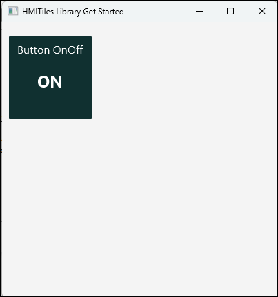

# HMITiles
**An Open-Source HMI Tile Library for Industrial Dashboards**

---

## Get Started

This guide shows how to create your first HMITiles project using a simple HMITileButton.

---

## Prerequisites

- B4J IDE installed
- HMITiles.b4xlib available

--

## Step 1 - Install the Library

1. Copy HIMTiles.b4xlib to the B4J or B4A additional libraries folder.

## Step 2 - Create a New B4J Project

1. Create a new folder named `HMITileButton`.
2. Start the B4J IDE.
3. Select menu File > New > B4XPages.
4. Choose the `HMITileButton`folder
5. Set project name `HMITileButton`.
6. Select the class `B4XMainPage`.

## Step 3 – Enable the HMITiles Library

1. Open the "Libraries Manager" tab.
2. Tick the library `HMITiles`.
3. Confirm the version is shown (for example 1.4.0).

## Step 4 - Design the UI

1. Opn the `Files Manager` tab.
2. Open `Mainpage.bjl` in the Designer.
3. Delete the default created button.
4. Select Add View > CustomView > HMITileButton.

**Set Properties**
- Name: TileButtonOnOff
- Title: Button OnOff
- State: OFF
- Button Style: Normal
- Width: 120
- Height: 120

**Generate Code**
Right click the tile and select:
- Generate Dim TileButton As HMITileButton
- Generate Click
Save and close the designer.

## Step 5 – Update B4XMainPage Code

**Enable Event Logging**
Uncomment or add the following in `Initialize`:
```
Public Sub Initialize
	B4XPages.GetManager.LogEvents = True
End Sub
```

**Remove Default Button Code**
In B4XMainPage, delete the sub `Private Sub Button1_Click`.
Delete the autogenerated sub:
```
Private Sub Button1_Click
	'...
End Sub
```

**Initialize the Tile**
In B4XPage_Created, add:
```
Private Sub B4XPage_Created (Root1 As B4XView)
	Root = Root1
	Root.LoadLayout("MainPage")
	B4XPages.SetTitle(Me, "HMITiles Library Get Started")

	' Must be set to enable CustomViews loading designer layouts
	Sleep(1)

	TileButtonOnOff.State = False
	TileButtonOnOff.StateText = "OFF"
End Sub
```

**Handle Button Clicks**

Add the following sub:
```
Private Sub TileButtonOnOff_Click
	' Reverse the button state
	TileButtonOnOff.SetState(TileButtonOnOff.State)

	' Set the button state text according button state
	TileButtonOnOff.StateText = IIf(TileButtonOnOff.State, "ON", "OFF")

	' Take action according button state:
	If TileButtonOnOff.State Then
		' Do something
	Else
		' Do something else
	End If

	' Log to the B4J IDE
	Log($"[TileButtonOnOff] state=${TileButtonOnOff.State}, statetext=${TileButtonOnOff.StateText}"$)
	' [TileButtonOnOff] state=true, statetext=ON
End Sub
```

## Step 6 - Compile and Run

Compile and Run the project.

**Expected B4J IDE Log Output**
```
*** mainpage: B4XPage_Created 
*** mainpage: B4XPage_Appear 
*** mainpage: B4XPage_Resize [mainpage]
[TileButtonOnOff] state=true
[TileButtonOnOff] state=false
```



## Full B4J B4XMainPage Code (Reference)
```
Sub Class_Globals
	Private Root As B4XView
	Private xui As XUI
	Private TileButtonOnOff As HMITileButton
End Sub

Public Sub Initialize
	B4XPages.GetManager.LogEvents = True
End Sub

Private Sub B4XPage_Created (Root1 As B4XView)
	Root = Root1
	Root.LoadLayout("MainPage")
	B4XPages.SetTitle(Me, "HMITiles Library Get Started")
	
	' Sleep must be set to enable customviews load designer layouts
	Sleep(1)	
	' Set initial properties
	TileButtonOnOff.State = False
	TileButtonOnOff.StateText = "OFF"
End Sub

Private Sub TileButtonOnOff_Click
	' Reverse the button state
	TileButtonOnOff.SetState(TileButtonOnOff.State)
	' Set the button state text according button state
	TileButtonOnOff.StateText = IIf(TileButtonOnOff.State, "ON", "OFF")
	' Take action according button state:
	If TileButtonOnOff.State Then
		' Do something
	Else
		' Do something else
	End If
	' Log to the B4J IDE
	Log($"[TileButtonOnOff] state=${TileButtonOnOff.State}, statetext=${TileButtonOnOff.StateText}"$)
	' [TileButtonOnOff] state=true, statetext=ON
End Sub
```

---

## Next Steps

- Explore other HMITiles (Readouts, Sensors, SeekBars, Trends)
- Review API.md for supported public interfaces
- Check example projects for real-world usage

